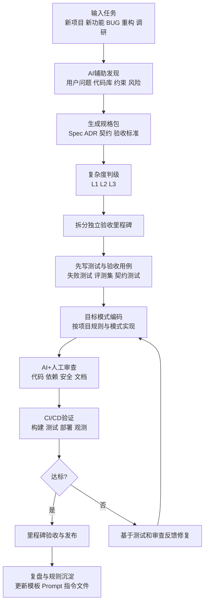
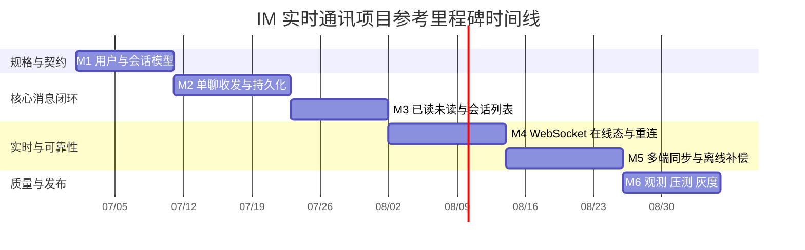

# 用户提问：

在使用AI进行产品研发的情况下，从一个想法到一个产品的工作流程应该是什么样子的？例如：番茄钟、个人博客、IM实时通讯，这些项目的复杂度不同，那如何动态调整流程来匹配对应的项目呢？ 

主要问题：

我现在想做一个适合各种分支（新项目、功能迭代、BUG、重构、调研等）及复杂度的工作流，因为现有的一些工作流不太符合我的要求，例如spec-kit、open-spec。

新项目：番茄钟、个人博客、IM实时通讯

新功能：加一句描述、对接AI实现智能客服 

这些复杂度不同，应该动态调整阶段对不对？所以我想做一个适合中文用户的工作流，标准化执行，一个大型项目/功能应该拆分为多个可独自验收的里程碑。通过AI编程工具的目标模式进行实际的开发验收

我要做的最终产品方向为：AI 辅助发现，规格驱动开发，测试驱动执行，目标模式编码。


# 面向中文用户的 AI 产品研发标准化工作流框架

## 执行摘要

本报告提出一套可按分支类型与复杂度动态伸缩的 AI 产品研发工作流：以 AI 辅助发现、规格驱动开发、测试驱动执行、目标模式编码为主线，用统一产物、分支策略、里程碑与验收机制，把新项目、新功能、BUG、重构与调研纳入同一框架，并给出中文模板、工具链、示例拆分、CI/CD 接入、风险控制与 KPI，便于团队直接落地。

## 设计原则与总体结构

这套框架不是把“AI 写代码”单独塞进现有流程，而是把 AI 放进**发现、规格、执行、验证、验收**的整个闭环。这样做的原因有三点。第一，规格驱动开发正在重新成为 AI 时代的软件工程核心：IBM 将其定义为在开发前先形成并达成一致的详细规格，把规格作为单一事实来源；Martin Fowler 也指出，Spec-Driven Development 的定义仍在快速演化，但共同点都是“先写 spec、再让 AI 按 spec 工作”；阿里云 Qoder CN 的官方 Spec 驱动模式则已经把“需求描述、设计方案、任务拆分、验收标准”做成了结构化产物。第二，测试反馈会显著提升 AI 生成代码的可靠性，AlphaCodium、TICODER 等研究都表明，基于测试与执行反馈的多阶段迭代，比只靠一次性提示生成代码更稳健。第三，AI 在仓库级软件任务上的效果高度依赖上下文、测试框架和现有代码库约束，SWE-bench 的设计就是让模型在真实仓库、真实 issue、真实测试框架里解决问题，而不是在脱离上下文的小题目上“看起来聪明”。 citeturn9search12turn9search6turn15search5turn18search0turn18search11turn9search1

因此，建议把工作流的核心重心放在四个动作上：**AI 辅助发现**负责快速理解业务、代码库与约束；**规格驱动开发**负责把需求转成结构化 spec、接口契约和验收标准；**测试驱动执行**负责先形成失败测试或验收用例，再让 AI 编码与修复；**目标模式编码**负责把架构风格、代码规范、测试命令、审查标准编码进仓库说明文件、提示文件和技能文件，让不同 AI 工具在同一套“项目规则”下工作。GitHub Copilot 支持仓库级自定义说明与可复用 prompt files；Claude Code 支持 `CLAUDE.md`、hooks、skills 与 GitHub Actions；OpenAI Codex 支持 skills 和 subagents；这些能力共同指向一个结论：**真正可复用的不是单条 prompt，而是“把团队规则文件化、仓库化、自动化”**。 citeturn11search9turn23search2turn11search13turn5search10turn5search11turn5search17turn17search14turn17search7

从组织方式上，这个框架借鉴 Scrum 对复杂产品的基本判断：复杂工作需要持续检视与适应，并围绕明确目标交付增量；与此同时，分支治理和代码合入必须由保护规则、必需评审和状态检查兜底。GitHub 官方文档明确支持受保护分支、必需 PR 评审、必需状态检查、对话关闭后才能合并；阿里云云效则把“分支开发、主干发布”和“一个需求对应一个 feature 分支”的实践文档化。这意味着 AI 时代不应弱化工程约束，反而要强化“**短分支 + 强校验 + 可独立验收里程碑**”的节奏。 citeturn19search0turn19search1turn19search4turn4search5turn4search1turn22search0turn22search6

下面的流程图给出建议的统一主流程。它是一个**可伸缩骨架**：轻量工作可以压缩步骤，复杂工作则在不改变主骨架的前提下增加深度。



## 工作流框架与分支策略

标准化框架建议采用**“一条主干、按任务短分支、按大型目标拆里程碑、按里程碑独立验收”**。对于高复杂度项目，可以保留 release 分支做集成验收；对低复杂度任务，则尽量维持 trunk-based 的快速小步合并。Atlassian 对 trunk-based development 的定义是“频繁、小规模地把更新合并到主干”，GitHub 则用受保护分支、评审与状态检查保证质量；阿里云云效说明中则同时支持“分支开发、主干发布”和“一个需求对应一个 feature 分支”的模式。基于这些一手资料，下面给出更适合 AI 研发协作的标准化框架。 citeturn22search7turn4search5turn4search1turn22search0turn22search6

| 阶段 | 核心目标 | 关键产出物 | 最低验收标准 | AI 适用动作 |
|---|---|---|---|---|
| 发现 | 明确问题、范围、假设、约束 | 任务卡、问题陈述、上下文摘要、风险清单 | 能回答“为什么做、为谁做、不做什么、风险在哪” | 代码库概览、用户反馈归纳、需求澄清 |
| 规格 | 把需求转成可执行说明书 | Spec、ADR、OpenAPI/AsyncAPI、数据模型、验收条款 | 需求边界、非功能要求、回滚思路明确 | 自动生成 spec、接口草案、测试草案 |
| 计划 | 拆里程碑与估算 | 里程碑列表、依赖图、时间估算、分支计划 | 每个大型目标都拆成可独立验收里程碑 | 任务拆分、风险排序、粗估排期 |
| 测试设计 | 先定义“怎么证明做对” | 单测/集成/E2E/契约/评测集 | 至少有一组可失败可通过的自动化或半自动验收 | 生成测试、补全边界场景、构造评测数据 |
| 实现 | 按目标模式编码 | 代码、配置、迁移脚本、文档更新 | 只实现当前里程碑范围；无未解释的越界改动 | 多文件修改、重构、Bug 修复 |
| 验证 | 自动化和人工双重校验 | CI 结果、审查记录、演示结果 | 构建通过、测试通过、评审通过、关键对话已解决 | 代码审查、依赖审查、解释 diff |
| 验收与发布 | 交付可验证增量 | 验收单、发布说明、回滚说明、复盘 | 能现场演示；能回滚；指标可观测 | 自动生成 release note、变更摘要 |

上表中的“规格”最好用机器可读格式承载关键契约。OpenAPI Initiative 指出，OpenAPI 是 HTTP API 的正式标准描述，可用于生成客户端、测试和设计标准；AsyncAPI Initiative 则将其定位为事件驱动接口的统一描述方式，特别适合消息、WebSocket 和异步通信场景。因此，凡是面向 HTTP 接口的功能，建议至少产出 `openapi.yaml`；涉及消息总线、订阅推送、实时通信的功能，建议补充 `asyncapi.yaml`。这会显著降低 AI 在大型代码库中“理解错接口”的概率。 citeturn12search9turn12search3turn12search1turn12search4

角色设计建议遵循“**职责可合并，责任不可模糊**”。即使是 1 人团队，也应显式切换视角：先做需求负责人，再做技术负责人，再做 QA/验收者，而不是始终以“编码者视角”决定一切。

| 角色 | 主要职责 | 可由谁兼任 |
|---|---|---|
| 需求负责人 | 定义目标、用户价值、范围边界、优先级、验收口径 | 产品、业务负责人、独立开发者本人 |
| 技术负责人 | 决策架构、接口契约、非功能要求、风险与回滚策略 | 架构师、主程、独立开发者本人 |
| 执行开发 | 实现 spec、补测试、修复缺陷、更新文档 | 开发、AI 代理配合的人类操作者 |
| QA/验收者 | 负责“是否真的达成验收条件”的独立判断 | QA、产品、技术负责人轮值 |
| AI 工作流管理员 | 维护仓库说明文件、prompt 模板、Agent skill、CI 规则 | 研发效能角色、Tech Lead、独立开发者本人 |

分支策略建议统一到一个命名规则里，避免 AI 代理、CI 和人工协作时产生歧义。GitHub 支持 issue forms、PR templates、repository templates；阿里云云效则建议把需求和分支形成一一映射。基于这些能力，可以把分支策略统一成下表。 citeturn20search13turn21search0turn21search14turn22search6turn22search0

| 分支类型 | 推荐前缀 | 适用场景 | 必经阶段 | 特殊要求 |
|---|---|---|---|---|
| 新项目 | `init/`、`milestone/` | 从 0 到 1 建库、打骨架、首版交付 | 发现 → 规格 → 计划 → 测试设计 → 实现 → 验证 → 验收 | 必须先建模板仓库与项目规则文件 |
| 新功能 | `feature/` | 现有系统增加能力 | 规格 → 计划 → 测试设计 → 实现 → 验证 → 验收 | 必须说明与现有能力的边界 |
| BUG | `bugfix/` 或 `hotfix/` | 缺陷修复、线上紧急故障 | 发现 → 测试设计 → 实现 → 验证 → 验收 | 必须先复现并补失败测试 |
| 重构 | `refactor/` | 改善结构、性能、可维护性 | 发现 → 规格 → 测试设计 → 实现 → 验证 | 必须定义“不变行为”和回归范围 |
| 调研 | `research/` | 技术选型、方案验证、可行性评估 | 发现 → 规格 → 验收 | 默认不进主干代码；产出结论与 PoC 记录 |

执行层面，建议把主干 `main` 设为受保护分支，强制执行：至少 1 次 PR 审核、必需状态检查、关键对话关闭后才允许合并；若是高风险仓库，再加 Code Owners、依赖变更审查和部署成功后才能合并。GitHub 官方文档明确支持这些规则；Copilot 代码审查和云代理还可以在 PR 前后提供自动反馈。 citeturn4search5turn4search6turn0search0turn0search11turn0search8

## 复杂度分级与动态调整

项目复杂度不应只按“代码量”判断。项目复杂性研究表明，复杂度往往由多个互相关联、相互依赖且不易预测的因素组成；而 COCOMO 一类估算方法虽然仍有价值，但更偏向以规模为主要参数。因此，AI 研发流程的复杂度分级更适合采用**多维评分 + 风险加权**，而不是只看功能点或页面数量。 citeturn8search6turn8search10turn8search3

建议使用下面的评分表。每个维度按 0、1、2 打分，最后求和。

| 维度 | 0 分 | 1 分 | 2 分 |
|---|---|---|---|
| 需求不确定性 | 已高度明确 | 有少量灰区 | 目标和边界都在变化 |
| 业务规则复杂度 | 少于 5 条简单规则 | 中等规则与状态流转 | 多角色、多状态、多例外 |
| 集成面 | 无外部集成 | 1–2 个外部系统 | 3 个以上或强依赖外部 SLA |
| 架构与并发 | 单体、同步、低并发 | 有后台任务或缓存 | 实时、分布式、消息驱动 |
| 数据与迁移 | 无持久化或简单表 | 有中等数据模型 | 多表迁移、历史兼容要求高 |
| 非功能要求 | 一般可用即可 | 有性能/可观测要求 | 有 SLA、安全、隐私、合规要求 |
| 变更爆炸半径 | 局部可逆 | 影响多个模块 | 影响核心域或对外接口 |
| 团队熟悉度 | 熟悉领域与栈 | 一半熟悉 | 新领域/新栈/跨团队合作 |

对应地，可以把项目分为三档。

| 复杂度等级 | 总分区间 | 典型示例 | 阶段深度 | 里程碑粒度 | 时间估算建议 | 验收准则 |
|---|---:|---|---|---|---|---|
| L1 轻量 | 0–5 | 番茄钟、文案微调、单点 Bug | 可压缩为 3–4 个阶段 | 1–3 个里程碑，每个 0.5–3 人日 | 总体 1–10 人日 | 演示通过 + 核心单测 + smoke test |
| L2 中等 | 6–10 | 个人博客、后台 CRUD、新 AI 功能接入早期版 | 使用完整标准流程 | 3–6 个里程碑，每个 2–7 人日 | 总体 2–8 周 | 单测/集成测试 + staging 验收 + 文档更新 |
| L3 高复杂 | 11–16 | IM 实时通讯、复杂 AI 客服、实时协作系统 | 在标准流程上增加架构/安全/压测/灰度 | 5–12 个里程碑，每个 3–10 人日，单个里程碑必须独立可验收 | 总体 2–6 个月以上 | 契约测试、性能/安全、回滚演练、灰度与观测 |

动态调整规则建议按“**复杂度 × 风险 × 可逆性**”三维决定，而不是按分支类型死板执行。下面这个矩阵最实用。

| 场景 | 处理建议 |
|---|---|
| 低复杂度 + 低风险 + 高可逆 | 可压缩为“发现/规格合并 → 测试设计 → 实现验收” |
| 低复杂度 + 高风险 | 不压缩规格；增加失败测试、回滚说明、至少 1 次人工评审 |
| 中复杂度 + 外部集成 | 强制输出接口契约与 mock 策略；增加集成测试 |
| 中复杂度 + 数据变更 | 增加迁移脚本审查、回填与回滚验证 |
| 高复杂度 + 实时/异步 | 强制输出 AsyncAPI、时序图、降级方案、压测与观测项 |
| 高复杂度 + AI 核心链路 | 增加评测集、对照组、人工抽检与灰度发布 |
| 线上紧急 Bug | 允许压缩发现和规格，但不允许跳过“复现—失败测试—修复—回归—回滚说明” |
| 纯调研 | 可以不进入实现阶段，但必须形成“结论、证据、建议、是否推进”的验收记录 |

大型项目或大型功能必须拆成**可独立验收的里程碑**。从管理上讲，这和 Scrum 2020 引入 Product Goal、Sprint Goal 的思想一致：每个阶段的增量都应让产品更接近总目标，而不是等到最后一次性交付全部价值。对 AI 研发尤其如此，因为 AI 工具最擅长在“小而清晰、边界明确、反馈快速”的任务单元中表现稳定。 citeturn19search4turn19search1turn18search16

下面给出一个高复杂度项目的参考时间线示意。注意，这不是固定工期，而是说明**必须先有可验收的分段**。



## 里程碑模板与示例

建议所有里程碑统一使用同一张“里程碑卡”。它的作用不是写文档给人看，而是给**人和 AI 同时作为执行契约**。

```markdown
里程碑名称：
目标：
范围内：
范围外：
依赖：
接口/数据契约：
测试与验收条款：
回滚方案：
完成定义 DoD：
- 代码合入前测试全部通过
- 文档/接口说明已更新
- 风险项已关闭或显式记录
- 可现场演示或可脚本复现
```

下面给出五个场景的拆分示例。示例中的工具是推荐组合，而不是唯一方案。

**示例一：番茄钟应用**

| 项目 | 内容 |
|---|---|
| 复杂度 | L1 轻量 |
| 里程碑清单 | M1 倒计时核心：开始、暂停、继续、重置；M2 工作/休息周期切换与通知；M3 任务记录与历史统计；M4 设置页与本地持久化 |
| 每个里程碑验收条件 | M1：计时误差在可接受范围、核心按钮状态正确；M2：周期切换后 UI 和提醒一致；M3：一条记录完整落库且历史可查询；M4：重启应用后设置与历史保留 |
| 所需 AI 工具 | Qoder CN/CodeBuddy 生成页面骨架与单测，GitHub Copilot `/tests` 生成 focused unit tests，GitHub Actions 跑构建与测试。Qoder CN 与 CodeBuddy 都提供中文 IDE 工作流；Copilot 支持 `/tests` 和可复用 prompt files。 citeturn14search13turn14search11turn14search4turn15search4turn23search0turn23search1turn3search3 |
| Prompt 示例 | `请基于番茄钟单页应用生成一份最小可行 spec：包含状态机、页面元素、失败场景、验收标准。先不要写代码，只输出结构化 spec。`；`请先为 timer reducer 生成失败测试，覆盖开始/暂停/继续/重置/切换周期 5 类场景；待测试失败后，再给出最小实现。` |

**示例二：个人博客**

| 项目 | 内容 |
|---|---|
| 复杂度 | L2 中等 |
| 里程碑清单 | M1 内容模型与文章发布链路；M2 前台文章列表、详情、标签与搜索；M3 后台登录、文章管理与草稿；M4 SEO、评论/订阅、站点统计；M5 部署、监控与备份 |
| 每个里程碑验收条件 | M1：文章可创建、草稿可保存、发布后可访问；M2：搜索/标签筛选正确、分页稳定；M3：未登录不可进入后台、草稿与发布的状态切换正确；M4：关键元信息输出正确；M5：CI/CD 自动部署成功、备份和恢复流程可验证 |
| 所需 AI 工具 | GitHub Copilot 研究/计划/迭代与代码评审，Qoder CN Spec 驱动生成需求/设计/任务拆分/验收标准，GitHub PR template 与 issue form 统一输入信息。Copilot 云代理可以研究、计划、在分支上迭代并创建 PR；Copilot 代码评审支持自动反馈；GitHub 支持 issue forms 与 PR templates。 citeturn13search7turn13search10turn0search0turn15search5turn20search13turn21search0 |
| Prompt 示例 | `你是博客系统的技术负责人。请把“个人博客 MVP”拆成 5 个可独立验收里程碑，每个里程碑必须包含：目标、范围内、范围外、数据库影响、API 契约、验收标准、回滚要点。`；`请按当前仓库的测试框架和目录结构，为文章发布链路生成单元测试与集成测试草案，优先覆盖状态流转、权限、分页和 SEO 元信息。` |

**示例三：IM 实时通讯**

| 项目 | 内容 |
|---|---|
| 复杂度 | L3 高复杂 |
| 里程碑清单 | M1 用户、会话、消息领域模型与 HTTP 契约；M2 单聊发消息/拉历史消息闭环；M3 WebSocket 建连、在线态、断线重连；M4 已读未读、会话列表与消息排序；M5 多端同步、离线补偿与幂等；M6 压测、观测、灰度发布 |
| 每个里程碑验收条件 | M1：OpenAPI 与数据模型评审通过；M2：消息可持久化且历史顺序正确；M3：掉线重连后会话恢复；M4：已读状态跨端一致；M5：重复投递不会产生重复消息；M6：关键指标、告警和回滚脚本完备 |
| 所需 AI 工具 | OpenAPI/AsyncAPI 作为契约主干，Claude Code/Codex/Copilot 做仓库级实现与重构，GitHub Actions 做 CI/CD。OpenAPI 是 HTTP API 的正式描述标准，AsyncAPI 用于事件驱动接口；Claude Code、Codex 和 Copilot 都支持读写代码、运行命令或在云环境中迭代。 citeturn12search9turn12search4turn5search2turn5search1turn17search3turn17search12turn13search7 |
| Prompt 示例 | `请为 IM 单聊系统输出第一阶段规格包：领域模型、消息状态机、OpenAPI、AsyncAPI、异常流、幂等策略、验收标准。假设后端已有用户系统，不要设计群聊。`；`请先生成契约测试和并发场景清单，再分批实现最小消息收发闭环。每次只完成一个里程碑，禁止跨里程碑实现。` |

**示例四：新功能“加一句描述”**

| 项目 | 内容 |
|---|---|
| 复杂度 | L1 轻量 |
| 里程碑清单 | M1 数据字段/配置项扩展；M2 UI 展示与国际化；M3 回归测试与发布 |
| 每个里程碑验收条件 | M1：新增字段对旧数据兼容；M2：页面展示正确，超长文本行为可控；M3：相关页面回归通过，无样式溢出 |
| 所需 AI 工具 | CodeBuddy `/fix`、`/tests`、Craft 模式适合中文快速改动；Qoder CN 文件级单测生成也适合小改动后回补测试。CodeBuddy 官方支持 `/fix`、`/tests`、Ask/Craft 模式；Qoder CN 文件级单元测试支持根据代码变更生成测试、编译运行并自动修复错误。 citeturn15search4turn14search4turn14search6turn14search11 |
| Prompt 示例 | `请只完成“在商品卡片上增加一句描述”的最小改动：先定位数据来源、展示位置、国际化资源与样式影响，再给出改动清单和失败测试。`；`请为新增描述字段补充回归测试，覆盖空值、超长、特殊字符和多语言场景。` |

**示例五：新功能“对接 AI 实现智能客服”**

| 项目 | 内容 |
|---|---|
| 复杂度 | L2 到 L3，视数据、渠道与安全要求而定 |
| 里程碑清单 | M1 业务边界与知识来源定义；M2 聊天 API/会话状态/埋点契约；M3 检索、提示模板与回答链路；M4 评测集、人工审核与兜底转人工；M5 后台运营、审计、灰度发布 |
| 每个里程碑验收条件 | M1：明确哪些问题能答、哪些必须转人工；M2：接口可联调且完整留痕；M3：回答链路可跑通，并有拒答/降级；M4：评测集达到目标阈值，误答案例被记录；M5：灰度与回滚开关可用 |
| 所需 AI 工具 | OpenAI 的评测最佳实践适合设计评测集与 grader，但官方也宣布 Evals 平台进入弃用流程，因此更适合把“评测数据集 + 评分脚本 + CI 触发”做成可迁移层；Qoder CN 的 Spec 驱动和 CodeBuddy 的 Craft 模式适合中文规格与研发；GitHub Actions 适合把回归评测并入 CI。 citeturn2search5turn2search1turn15search5turn14search4turn14search6turn3search3 |
| Prompt 示例 | `请把“智能客服”拆成 5 个可独立验收里程碑，并明确：知识边界、拒答策略、转人工条件、日志字段、评测样本结构、灰度方案。先输出 spec，不写代码。`；`请根据以下 30 条真实客服问答生成评测集，并给出通过标准：答案相关性、是否命中知识来源、是否遵守拒答与转人工规则。` |

对 IM 或智能客服这类高复杂项目，建议在里程碑拆分时强制遵守两条规则：第一，**任何一个里程碑都必须可以被单独演示和签收**；第二，**任何一个里程碑都不能把“核心行为正确性”寄托给后续里程碑补救**。这也是为什么先做契约、先做测试、再做实现，比“一口气让 AI 写完整项目”稳得多。AlphaCodium、执行反馈与自我调试相关研究都支持这种“先定义验证，再迭代生成”的路径。 citeturn18search0turn18search4turn18search2

## AI 集成模式、落地路线图与 KPI

从工具链角度看，建议按“**发现/规格、编码/修复、测试/审查、CI/CD**”四层选择工具，而不是寻找单一万能工具。对于中文用户，Qoder CN 与腾讯云 CodeBuddy 的中文文档和中文工作流成熟度更直接；对于仓库级 Agent 能力，GitHub Copilot、Claude Code、OpenAI Codex 更强；对于 CI/CD 与评审治理，GitHub Actions 与 GitHub 的分支保护、PR 模板、Copilot 代码评审组合最完整。下面给出一个实用的工具链对照。 citeturn14search13turn16search2turn0search4turn5search2turn17search1turn3search3turn4search5

| 工具 | 更适合的环节 | 关键官方能力 | 适用建议 |
|---|---|---|---|
| GitHub Copilot | 研究、计划、PR 审查、单测生成 | 云代理可研究/计划/迭代并创建 PR；代码评审可自动给反馈；支持仓库自定义说明与 prompt files；支持 `/tests` 或可复用 unit test prompt。 citeturn13search7turn0search0turn11search9turn23search1turn23search0 | 适合 GitHub 主导的团队，尤其适合把 AI 纳入 PR 生命周期 |
| Claude Code | 仓库级理解、并行任务、CI 自动化 | 能读整个代码库、编辑文件、运行命令；支持 `CLAUDE.md`、hooks、skills、GitHub Actions。 citeturn5search2turn5search10turn5search11turn5search1 | 适合复杂代码库、重构、批量任务、规则自动执行 |
| OpenAI Codex | 本地/云代理编码、skills、subagents | 支持本地 CLI、Cloud、IDE extension；可读写运行代码；支持 skills 与 subagents。 citeturn17search12turn17search3turn17search14turn17search7 | 适合需要多代理分工和长链路任务的团队 |
| Qoder CN | 中文 spec、任务拆分、单测生成、遗留代码维护 | 官方 Spec 驱动可生成需求/设计/任务拆分/验收标准；支持文件级单元测试生成、编译运行与自动修复；支持遗留代码理解与测试生成。 citeturn15search5turn14search11turn6search1turn14search5 | 最适合中文团队做“规格先行 + 测试回补” |
| CodeBuddy | 中文 IDE 工作流、快速修复、Craft 模式 | Ask/Craft 模式、`/fix`、`/tests`、自定义指令/全局提示词、代码规范与错误修复。 citeturn14search4turn15search4turn14search10 | 适合中文开发者做日常功能、小中型任务与快速修复 |

最推荐的落地方式不是“选一个工具 all in”，而是用一个**仓库模板**把流程固化下来。GitHub 官方支持把仓库做成模板，从而一次性复制目录结构、分支与规则文件；同时支持 issue forms 和 PR templates，把任务输入标准化。可执行的模板目录建议如下。 citeturn21search14turn20search13turn21search0

```text
.github/
  ISSUE_TEMPLATE/
    feature.yml
    bug.yml
    refactor.yml
    research.yml
  PULL_REQUEST_TEMPLATE/
    default.md
    hotfix.md
  copilot-instructions.md
  prompts/
    generate-spec.prompt.md
    generate-tests.prompt.md
    review-changes.prompt.md
specs/
  {issue-id}/
    spec.md
    adr.md
    acceptance.md
contracts/
  openapi.yaml
  asyncapi.yaml
tests/
  unit/
  integration/
  contract/
  e2e/
  evals/
docs/
  workflow.md
CLAUDE.md
```

围绕这个模板，建议建立一套最小中文版 checklist。为了便于直接使用，下面给出可复用清单。

**任务进入开发前清单**

- 任务类型已标记为：新项目 / 新功能 / BUG / 重构 / 调研  
- 复杂度等级已评为 L1 / L2 / L3  
- 范围内与范围外已写清  
- 非功能要求已标注：性能 / 安全 / 可观测 / 合规 / 无  
- 里程碑已拆成独立可验收单元  
- 每个里程碑都有验收条件和回滚说明  

**代码合入前清单**

- 失败测试已先存在或已说明为什么无法自动化  
- 代码仅覆盖当前里程碑范围  
- 文档、契约、迁移、配置同步更新  
- AI 生成代码已人工审查  
- PR 模板已填写风险、测试、回滚项  
- CI 全部通过，关键对话已关闭  

**里程碑验收清单**

- 可现场演示或脚本复现  
- 验收条款逐条勾选  
- 指标与日志可观测  
- 回滚开关或回滚脚本可用  
- 已记录已知限制和后续项  

Prompt 库也应该标准化，而不是每次临时发挥。GitHub、Claude Code、Codex 和 CodeBuddy/Qoder 都支持不同形式的持久化说明、提示文件或技能文件，因此更好的做法是把 prompt 模板版本化。 citeturn11search9turn11search13turn5search10turn17search14turn14search10

```markdown
[发现阶段 Prompt]
请先不要写代码。读取当前仓库/需求上下文后，只输出：
1. 目标用户与核心问题
2. 范围内/范围外
3. 已知约束
4. 风险清单
5. 建议复杂度等级
6. 建议里程碑拆分

[规格阶段 Prompt]
请将任务转成结构化 spec，包含：
- 用户场景
- 接口/数据契约
- 非功能要求
- 验收标准
- 回滚方案
- 不实现内容
禁止直接进入编码。

[测试阶段 Prompt]
请先生成失败测试，不要实现业务代码。
要求：
- 优先边界条件与错误分支
- 说明每个测试覆盖的验收条款
- 如需要 mock，请遵循当前仓库测试框架

[实现阶段 Prompt]
请严格按照当前 spec 的里程碑 {M} 实现。
限制：
- 不跨里程碑新增能力
- 不修改无关文件
- 每次提交前解释变更原因、测试命令和潜在风险

[审查阶段 Prompt]
请按以下顺序审查：
1. 是否偏离 spec
2. 是否遗漏测试
3. 是否引入接口不兼容
4. 是否缺少回滚说明
5. 是否违反仓库规则文件
输出：必须修复 / 建议优化 / 可接受风险
```

在实现细节上，下面五个集成点最关键：

一是**自动生成 spec**。对中文团队，Qoder CN 的 Spec 驱动模式和 CodeBuddy 的 Craft 模式很适合作为需求到规格的入口；对 GitHub 团队，可用 prompt files 固化“生成 spec”“文档 API”“评审代码”等重复任务。 citeturn15search5turn14search6turn23search4turn13search13

二是**自动生成测试**。GitHub Copilot 的 `/tests` 与 generate-unit-tests prompt file、Qoder CN 的文件级单元测试、CodeBuddy 的 `/tests` 都可用，但 GitHub 官方也明确提醒：生成的测试未必覆盖所有场景，必须人工审阅并补齐边界条件。因此，正确姿势不是“让 AI 负责质量”，而是“让 AI 加速测试初稿，再用仓库规则和人工验收兜底”。 citeturn23search0turn23search1turn14search11turn6search6

三是**自动修复 BUG**。CodeBuddy 支持 `/fix`；GitHub 提供 Bug Fix Teammate 自定义代理示例；Claude Code 和 Codex 则适合处理需要通读仓库、执行命令、定位上下文的复杂缺陷。最佳实践是先固定“复现脚本/失败测试”，再授权 AI 修复。 citeturn15search4turn15search3turn5search0turn17search12

四是**AI 代码审查**。GitHub Copilot 代码评审可自动审核 PR 并给出可应用的建议；Claude Code GitHub Actions 允许通过 `@claude` 在 PR 或 issue 中触发分析与修改；阿里云 Qoder CN 的官方客户案例也展示了在企业内做 AI 评审的实践数据，例如哈啰集团“每周 180 个应用通过 AI 完成评审，平均每周发现 140 个 bug”。但这类案例应被视为实践参考，不是通用承诺。 citeturn0search0turn0search11turn5search1turn14search3

五是**CI/CD 集成**。GitHub Actions 是直接可用的自动化平台，能在 push、PR、issue 等事件上执行构建、测试、部署；GitHub Copilot 云代理的临时开发环境本身也由 GitHub Actions 提供支持；Claude Code 可接入 GitHub Actions；这使得“AI 生成改动 → 自动运行测试/代码检查 → 人工签收”成为非常自然的流水线。 citeturn3search3turn3search6turn0search8turn5search1

风险与限制也必须明确写进流程。第一，AI 代码工具会**过度自信**，尤其在上下文不足、测试不足、契约缺失时更明显；SWE-bench 之所以要求在真实仓库内解题，正是因为“仓库级上下文”决定了问题难度。第二，AI 可能受不可信输入影响，Anthropic 官方安全文档明确建议审查建议命令、不要把不可信内容直接喂给模型、核验关键文件；GitHub 也公开说明其云代理默认启用防火墙式执行环境以减少数据外泄风险。第三，评测平台和工具本身会演进，OpenAI 已宣布 Evals 平台进入弃用流程，因此长期落地时要把评测能力做成“数据与脚本可迁移”的层。 citeturn9search1turn5search13turn0search13turn0search8turn2search1turn2search5

落地路线图建议分三段推进。

| 时段 | 目标 | 关键动作 |
|---|---|---|
| 短期 | 建立统一骨架 | 建模板仓库；配置 issue form、PR template、主干保护；沉淀 `copilot-instructions.md` / `CLAUDE.md`；选 1 个 L1 与 1 个 L2 场景试点 |
| 中期 | 标准化与可复制 | 把 spec 模板、里程碑卡、Prompt 库、CI 检查做成默认资产；引入自动代码评审与测试生成；开始采集基线 KPI |
| 长期 | 平台化与度量闭环 | 将评测集、灰度发布、观测、回滚、AI 采纳率接到统一研发效能看板；建立高复杂度项目的架构/安全门禁 |

KPI 建议同时看**交付速度、稳定性、质量、AI 真实价值**四个面向。DORA 将部署频率、变更前置时间、变更失败率、失败恢复时间视为行业标准指标；阿里云通义灵码的评估实践指南则强调，评估 AI 编码工具不能只看单一效率指标，而应同时关注研发效率、代码质量、开发者体验，并先建立基线再比较变化。DORA 官方 2024 报告还指出，AI 的影响需要与团队的人本因素、用户需求和稳定优先级共同考量；该报告与官方信息图也很适合作为管理层汇报时的图表参考。 citeturn7search4turn7search5turn14search1turn7search1turn7search11turn7search8

| KPI 维度 | 指标 | 建议口径 |
|---|---|---|
| 交付速度 | 里程碑 lead time、PR 周期、部署频率 | 对齐 DORA 与里程碑级标签 |
| 稳定性 | 变更失败率、回滚率、恢复时间 | 以发布和里程碑验收为口径 |
| 质量 | 测试通过率、缺陷逃逸率、审查发现问题数 | 把 AI 审查与人工审查分开统计 |
| AI 价值 | AI 代码采纳率、测试生成采纳率、spec 生成覆盖率 | 必须与基线对比，不单独看绝对值 |
| 体验与协作 | 新成员上手时间、需求澄清轮次、返工率 | 更适合中长期观察 |
| AI 功能专项 | 评测集得分、拒答准确率、转人工命中率 | 适用于智能客服等 AI 产品能力 |

最后给出一句落地原则：**先把“任务输入、规格格式、里程碑卡、测试门禁、合入规则”标准化，再让 AI 接管重复劳动；不要反过来先让 AI 大量产出，再用人去补救流程。** 对中文团队而言，最务实的落地组合通常是：**Qoder CN 或 CodeBuddy 承担中文规格与 IDE 内快速执行，GitHub Copilot/Claude Code/Codex 承担仓库级实现与审查，GitHub Actions 承担 CI/CD，OpenAPI/AsyncAPI 承担契约，DORA + 团队基线指标承担度量**。这样既能保留中文环境下的生产力优势，也能把工程质量锁进标准化流程里。 citeturn14search13turn16search2turn13search7turn5search1turn17search12turn3search3turn12search3turn12search4turn7search5turn14search1

---

# 第二轮提问

- 是不是每个阶段都是一个独立的职责，例如产品经理、编程专家、测试评审员等？
- 关于规格包：我觉得是不是应该生成一份用户能看懂的文档，例如需求文档、、架构文档、UI/UX设计文档从中拆分可执行说明书？因为用户也需要进行审查，而不是只有AI阅读
- 人工评审：我觉得在目标模式编码前是不是应该每一步都由用户来评审，因为用户需要确认需求、技术栈、产品主题等。而进入到目标模式后，进行自动评审机制？因为编码阶段不需要人工干预，还是说你有更好的方法？
- 你给出的里程碑模板示例一：番茄钟应用
  - 所需AI工具：用户难道不是在一个AI工具上完成整个流程吗？若有需要外部的工具需要通过MCP等方式连接，而不是用户手动操作。
  - Prompt示例：用户怎么可能会写这么多专业的提示词呢，一般都是模糊的，需要AI按照流程进行多轮对话澄清为明确的需求，然后一步步的写出规格，拆分为各自的里程碑才对吧？而且一般一个仓库只有一个项目，所以不需要按示例这种在一个表格中显示所有的里程碑，每个里程碑一个表格也可以的。
- 我是想做一套自己的流程，而不是使用AI工具自己的spec

# 第二轮返回

你的判断基本是对的，但我建议把它再抽象一层：**你做的不是“规格模板”，而是一个面向中文用户的 AI 产品研发流程引擎**。

它的核心不是让用户写专业 Prompt，而是：

> 用户输入一个模糊想法 → AI 通过多轮澄清变成用户可审查的规格包 → 再从规格包拆分出里程碑 → 每个里程碑生成可执行目标合约 → 交给 AI 编程工具目标模式执行 → 自动测试与评审 → 用户验收里程碑。

------

## 1. 阶段是不是独立职责？

是，但要注意：**阶段是职责，不一定是独立 Agent，也不一定是独立人物。**

更准确地说，每个阶段应该定义三件事：

| 阶段     | 职责视角              | 核心产物                            |
| -------- | --------------------- | ----------------------------------- |
| 需求发现 | 产品经理 / 业务分析师 | 需求说明、用户故事、范围边界        |
| 产品设计 | 产品经理 / UX 设计师  | 页面、流程、交互、文案、主题风格    |
| 技术规划 | 架构师 / 技术负责人   | 技术栈、架构、数据模型、接口方案    |
| 测试设计 | 测试评审员            | 验收标准、测试用例、回归用例        |
| 任务拆解 | 交付经理              | 里程碑、任务依赖、执行顺序          |
| 编码执行 | 编程专家              | 代码变更、测试、提交说明            |
| 自动评审 | Code Reviewer / QA    | Diff 审查、测试报告、规格符合性报告 |
| 规格维护 | 规格管理员            | 规格回写、变更记录、漂移检测        |

所以你的系统里可以有多个“角色视角”，但用户体验上不应该暴露成“请切换到产品经理 Agent / 架构师 Agent / 测试员 Agent”。用户应该只看到一个统一流程。

Spec Kit 这类工具本身也已经把流程拆成类似 constitution、specify、plan、tasks、implement、clarify、analyze、checklist 等命令，这说明“阶段化职责”是合理方向；但你的产品应该把这些命令式动作进一步产品化、中文化、自动编排化，而不是让用户手动调用命令。([GitHub](https://github.com/github/spec-kit))

------

## 2. 规格包应该给谁看？

你说得对：**规格包首先要给人看，其次才给 AI 看。**

我建议把规格包设计成三层。

### 第一层：用户可读规格

这是给非技术用户、产品负责人、团队成员看的。

包含：

| 文档             | 作用                                   |
| ---------------- | -------------------------------------- |
| 产品需求文档 PRD | 说明做什么、为什么做、给谁用           |
| 范围说明         | 明确本次做什么、不做什么               |
| 用户故事         | 从用户视角描述行为                     |
| UI/UX 设计文档   | 页面结构、操作流程、主题风格、交互规则 |
| 验收标准         | 用户如何判断“完成了”                   |
| 里程碑计划       | 每一阶段交付什么、如何验收             |

### 第二层：工程可读规格

这是给技术人员和 AI 编程工具看的。

包含：

| 文档           | 作用                           |
| -------------- | ------------------------------ |
| 技术方案       | 技术栈、架构、模块边界         |
| 数据模型       | 表结构、状态模型、实体关系     |
| API / 接口契约 | 请求、响应、错误码、权限       |
| 测试计划       | 单元测试、集成测试、端到端测试 |
| 风险与约束     | 性能、安全、兼容性、部署约束   |

### 第三层：目标模式执行说明书

这是给 AI 编程工具目标模式用的，不应该要求用户直接写。

每个里程碑生成一份独立的 **Goal Contract**，内容包括：

```text
目标：实现番茄钟核心计时功能

输入：
- 已确认的需求规格
- 已确认的 UI/UX 规则
- 已确认的技术栈
- 当前仓库代码状态

允许修改：
- src/timer/*
- src/components/TimerView.*
- tests/timer/*

禁止修改：
- 登录模块
- 部署配置
- 与本里程碑无关的样式系统

完成标准：
- 用户可以开始、暂停、继续、重置计时
- 刷新页面后状态按规格恢复或清空
- 所有关联测试通过
- UI 截图符合设计说明
- 不引入新的 lint / type / test 错误

自动验证：
- npm test
- npm run lint
- npm run typecheck
- 指定 E2E 场景
```

这才是“规格驱动开发”的关键：**用户审查人话文档，AI 执行机器友好合约。**

------

## 3. 人工评审应该放在哪里？

你的直觉也对：**进入目标模式编码前，关键阶段应该由用户评审；进入目标模式后，主要依靠自动评审。**

但我不建议“每一步都人工评审”。更好的设计是：**决策门评审，而不是过程步评审。**

### 编码前：人工评审门

| 评审门           | 用户需要确认什么                           |
| ---------------- | ------------------------------------------ |
| G0：任务类型确认 | 这是新项目、功能、Bug、重构还是调研？      |
| G1：需求确认     | 目标、用户、范围、不做什么是否正确？       |
| G2：产品确认     | 页面、流程、主题、文案、交互是否符合预期？ |
| G3：技术确认     | 技术栈、架构、依赖、存储、部署是否可接受？ |
| G4：里程碑确认   | 拆分是否合理？每个里程碑能否独立验收？     |
| G5：执行授权     | 是否允许 AI 进入目标模式编码？             |

### 编码中：自动评审为主

进入目标模式后，AI 不应该频繁打断用户，而应该自动完成：

| 自动机制        | 作用                             |
| --------------- | -------------------------------- |
| 测试执行        | 判断功能是否满足测试             |
| 静态检查        | lint、typecheck、格式化          |
| Diff 审查       | 检查是否越权修改                 |
| 规格追踪        | 检查代码是否覆盖验收标准         |
| 回归检测        | 检查旧功能是否被破坏             |
| 截图 / 预览验证 | 对 UI 项目尤其重要               |
| 安全检查        | 对登录、支付、AI 客服、IM 等必要 |

### 编码中只在这些情况打断用户

| 情况                     | 是否打断     |
| ------------------------ | ------------ |
| 技术细节可由规格推导     | 不打断       |
| 测试失败但 AI 可修复     | 不打断       |
| 发现需求矛盾             | 打断         |
| 需要新增依赖 / 改技术栈  | 打断         |
| 需要扩大修改范围         | 打断         |
| 可能影响数据、安全、费用 | 打断         |
| 里程碑完成               | 交给用户验收 |

所以完整逻辑应该是：

```text
人工评审需求、方案、里程碑
        ↓
用户授权目标模式
        ↓
AI 自主编码 + 自动测试 + 自动评审
        ↓
异常才中断
        ↓
里程碑完成后用户验收
```

------

## 4. 用户不应该写复杂 Prompt

完全正确。

你给的例子里，我之前那种“Prompt 示例”更适合开发者手动操作 AI 工具，不适合你要做的产品。

你的产品应该是：

```text
用户：我想做一个番茄钟应用
AI：你是想做网页、桌面端还是手机端？
用户：网页
AI：是否需要任务管理、历史统计、白噪音、账号同步？
用户：先不要账号，要任务和统计
AI：你喜欢极简风格、可爱风格还是专注办公风格？
用户：极简
AI：我已生成需求草案，请确认……
```

用户输入是自然语言，系统负责生成：

```text
需求规格
UI/UX 规格
技术规格
测试规格
里程碑规格
目标模式执行合约
```

用户不写 Prompt，用户只做三件事：

1. 表达想法
2. 回答澄清问题
3. 审查和批准规格

专业 Prompt 应该被封装在你的流程引擎、角色定义、模板系统和工具适配器里。

------

## 5. “所需 AI 工具”不应该暴露给用户

你说得对。

从用户视角看，应该是：

> 我在一个产品里完成从想法到交付。

不是：

> 我先用 ChatGPT 写需求，再用 Claude Code 编码，再用 Cursor 修复，再用 Playwright 测试。

外部工具应该变成你的系统能力：

| 用户看到 | 系统内部实际可能调用                               |
| -------- | -------------------------------------------------- |
| 生成规格 | LLM / 知识库 / 模板引擎                            |
| 分析仓库 | Git / 文件系统 / 代码索引                          |
| 执行编码 | Claude Code / Codex / Cursor / Gemini CLI 等适配器 |
| 运行测试 | npm、pytest、go test、Playwright                   |
| 查资料   | 浏览器、搜索、官方文档 MCP                         |
| 部署预览 | Vercel、Docker、云服务 MCP                         |
| 任务管理 | GitHub Issues、Linear、Notion、Jira MCP            |

所以规格里不应该写“所需 AI 工具：Claude / Cursor / ChatGPT”。

应该写：

```text
所需能力：
- 代码仓库读写能力
- 测试命令执行能力
- 浏览器预览能力
- 截图对比能力
- Git 分支与提交能力
- 可选：部署预览能力
```

然后由系统判断当前环境是否已连接这些能力。

------

## 6. 你要做的是“自己的流程”，不是 AI 工具自己的 spec

这个方向是对的。

Spec Kit 很有参考价值，它强调多阶段 refinement，而不是一次性 vibe coding；也支持通过 extensions、presets、bundles 定制模板、命令和角色化配置。([GitHub](https://github.com/github/spec-kit)) 但它仍然更像“面向开发者和 AI 编程代理的流程工具”。你要做的应该是“面向中文用户的产品研发工作流”，规格是你的产品资产，而不是某个 AI 工具的内部格式。

更准确的产品定位可以是：

> 一个 AI 辅助的中文规格驱动研发系统，负责把模糊想法转化为可审查规格、可验收里程碑和可执行目标合约，并通过外部 AI 编程工具完成实现与自动验收。

近期一篇对 AI 软件开发 Agent 框架的综述也提到，GitHub Spec Kit、OpenSpec、BMAD、GSD 等框架都在从 prompt 转向 process，但没有一个框架在规格、上下文、角色、执行、验证、可移植性六个维度上都强覆盖，这正好说明你的“流程引擎 + 中文用户体验 + 动态裁剪 + 验收闭环”有产品空间。([arXiv](https://arxiv.org/abs/2606.04967?utm_source=chatgpt.com))

------

## 7. 我建议你的流程主干这样设计

可以命名为：

> **发现 → 规格 → 设计 → 验收 → 里程碑 → 目标执行 → 自动评审 → 交付回写**

流程图可以是：

```text
模糊想法
  ↓
任务分诊
  ↓
复杂度评估
  ↓
AI 辅助发现 / 多轮澄清
  ↓
用户可读规格包
  ↓
人工评审
  ↓
技术设计 / UI 设计 / 测试设计
  ↓
人工评审
  ↓
里程碑拆分
  ↓
人工评审
  ↓
生成目标模式执行合约
  ↓
AI 编程工具执行
  ↓
自动测试 / 自动评审
  ↓
用户验收
  ↓
规格回写 / 发布 / 下一里程碑
```

------

## 8. 动态裁剪：不同复杂度走不同流程

你需要一个复杂度分级器，而不是固定流程。

### 复杂度评分维度

每个维度 0-2 分：

| 维度         | 0 分          | 1 分     | 2 分                   |
| ------------ | ------------- | -------- | ---------------------- |
| 需求清晰度   | 完全明确      | 部分模糊 | 高度模糊               |
| 影响范围     | 单文件/小改动 | 多模块   | 系统级                 |
| UI/UX 复杂度 | 无 UI         | 简单页面 | 多页面/复杂交互        |
| 数据复杂度   | 无持久化      | 简单数据 | 复杂状态/权限/同步     |
| 集成复杂度   | 无外部依赖    | 少量 API | 多系统/第三方/AI       |
| 风险等级     | 低            | 中       | 高，涉及安全/资金/隐私 |
| 测试要求     | 手动确认即可  | 自动测试 | 完整回归/压测/安全测试 |

总分决定流程：

| 等级                   | 适用场景                         | 流程                                         |
| ---------------------- | -------------------------------- | -------------------------------------------- |
| L0 极小变更            | 加一句描述、改文案、调样式       | 变更卡 → 用户确认 → 目标执行 → 自动检查      |
| L1 小功能 / 小 Bug     | 简单按钮、表单校验、修复明显 Bug | 简版需求 → 验收标准 → 执行合约 → 自动测试    |
| L2 中等功能            | 番茄钟、简单博客、任务列表       | PRD + UI + 技术说明 + 测试计划 + 里程碑      |
| L3 完整模块 / 中型项目 | 个人博客含后台、评论、部署       | 完整规格包 + 架构 + 数据模型 + 多里程碑      |
| L4 高复杂项目          | IM、AI 客服、支付、权限系统      | 加入风险评审、接口契约、安全、观测、回滚方案 |
| L5 高风险系统          | 金融、医疗、企业核心系统         | 强制审计、合规、测试矩阵、灰度、人工多级审批 |

------

## 9. 不同分支应该有不同流程

### 新项目流程

适合：番茄钟、个人博客、IM。

```text
项目愿景
→ 用户与场景
→ 范围边界
→ 功能地图
→ UI/UX 设计
→ 技术架构
→ 测试策略
→ 里程碑拆分
→ 逐里程碑目标执行
```

### 新功能流程

适合：加一句描述、AI 智能客服。

```text
功能目标
→ 影响范围分析
→ 用户故事
→ 验收标准
→ 技术影响
→ 测试用例
→ 目标执行
```

加一句描述可能只走 L0。

AI 智能客服虽然是“一个功能”，但因为涉及 LLM、知识库、误答、兜底、日志、隐私和成本，应该按 L4 处理。

### Bug 流程

```text
问题描述
→ 复现步骤
→ 期望行为
→ 实际行为
→ 根因假设
→ 回归测试
→ 修复合约
→ 自动验证
```

Bug 不需要 PRD，但必须有“复现 + 期望 + 回归测试”。

### 重构流程

```text
重构目标
→ 当前问题
→ 行为不变约束
→ 影响范围
→ 保护性测试
→ 分阶段重构
→ 回归验证
```

重构的核心不是“实现新功能”，而是：

> 外部行为不变，内部结构改善。

### 调研流程

```text
调研问题
→ 决策背景
→ 候选方案
→ 对比维度
→ 风险分析
→ 推荐结论
→ ADR 决策记录
```

调研不应该直接进入编码，除非用户确认某个方案。

------

## 10. 里程碑应该独立可验收

你说“每个里程碑一个表格也可以”，我同意，而且更推荐。

不要在一个大表里堆所有里程碑。应该是：

```text
milestones/
  M01-project-foundation.md
  M02-core-timer.md
  M03-task-history.md
  M04-polish-and-release.md
```

每个里程碑单独包含：

| 字段         | 说明                     |
| ------------ | ------------------------ |
| 里程碑目标   | 本阶段交付什么           |
| 用户价值     | 为什么这个阶段独立有意义 |
| 范围内       | 本阶段做什么             |
| 范围外       | 本阶段不做什么           |
| 前置依赖     | 需要已有的内容           |
| 可验收结果   | 用户能看到什么           |
| 自动测试     | 如何机器验证             |
| 人工验收     | 用户如何确认             |
| 目标模式合约 | 给 AI 编程工具执行的说明 |

------

## 11. 举例：番茄钟应该如何拆

### M01：项目基础与视觉主题

| 项目 | 内容                           |
| ---- | ------------------------------ |
| 目标 | 创建应用基础结构和极简主题     |
| 交付 | 首页、基础布局、主题变量、导航 |
| 验收 | 用户打开页面能看到番茄钟主界面 |
| 不做 | 不实现完整计时逻辑             |

### M02：核心计时器

| 项目     | 内容                              |
| -------- | --------------------------------- |
| 目标     | 实现开始、暂停、继续、重置        |
| 交付     | 25 分钟专注、5 分钟休息、状态切换 |
| 验收     | 用户可以完整完成一个番茄钟周期    |
| 自动测试 | 计时状态、按钮状态、边界状态测试  |

### M03：任务与历史记录

| 项目 | 内容                           |
| ---- | ------------------------------ |
| 目标 | 绑定任务并记录完成历史         |
| 交付 | 任务列表、完成记录、本地存储   |
| 验收 | 用户能看到今天完成了几个番茄钟 |

### M04：体验优化与发布

| 项目 | 内容                           |
| ---- | ------------------------------ |
| 目标 | 完成声音、通知、响应式、部署   |
| 交付 | 提醒音、浏览器通知、移动端适配 |
| 验收 | 可部署、可访问、主要场景无错误 |

这比“一次性做完整番茄钟”更适合目标模式，因为每个里程碑都有明确边界。

------

## 12. 几个项目的复杂度差异

| 项目        | 建议等级 | 原因                                           |
| ----------- | -------- | ---------------------------------------------- |
| 加一句描述  | L0       | 文案小改动，无需完整规格                       |
| 番茄钟      | L2       | 有 UI、状态、计时逻辑、本地存储                |
| 个人博客    | L2-L3    | 取决于是否有后台、评论、登录、部署             |
| AI 智能客服 | L4       | 涉及 LLM、知识库、兜底、评估、安全             |
| IM 实时通讯 | L4-L5    | 实时连接、消息一致性、离线、推送、权限、扩展性 |

这就是为什么你的流程必须动态裁剪。**复杂度不是看“项目名字”，而是看影响范围、数据状态、集成、风险和验收难度。**

------

## 13. 推荐你的产品内部结构

可以这样组织仓库规格：

```text
.ai-flow/
  project.md                 # 项目总览
  constitution.md            # 项目原则：代码质量、测试、风格、约束
  decisions/                 # ADR 决策记录
    ADR-001-tech-stack.md

specs/
  product-requirements.md    # 用户可读 PRD
  ux-design.md               # UI/UX 说明
  architecture.md            # 技术架构
  test-strategy.md           # 测试策略

work-items/
  001-pomodoro-app/
    intake.md                # 原始想法与澄清记录
    classification.yml       # 类型与复杂度
    requirements.md          # 需求规格
    acceptance.md            # 验收标准
    milestones/
      M01-foundation.md
      M02-core-timer.md
      M03-task-history.md
    goals/
      M01-goal-contract.md
      M02-goal-contract.md
      M03-goal-contract.md
    review/
      M01-auto-review.md
      M02-auto-review.md
```

关键原则：

> specs 是人和 AI 的共同源头，goals 是某个里程碑的执行合约，review 是执行后的证据。

------

## 14. 你的最终产品方向可以这样收敛

你原来的方向是：

> AI 辅助发现，规格驱动开发，测试驱动执行，目标模式编码。

我建议升级成一句产品定义：

> **面向中文用户的 AI 规格驱动研发平台：通过 AI 辅助发现将模糊想法转化为用户可审查的规格包，再拆分为独立可验收的里程碑，并生成目标模式执行合约，调用 AI 编程工具完成测试驱动开发与自动评审。**

四个核心模块：

| 模块         | 作用                                           |
| ------------ | ---------------------------------------------- |
| AI 辅助发现  | 通过对话澄清需求、场景、范围、约束             |
| 规格包生成   | 生成用户可读 + 工程可读 + AI 可执行文档        |
| 里程碑编排   | 按复杂度拆成独立可验收交付单元                 |
| 目标模式执行 | 把每个里程碑交给 AI 编程工具自主完成并自动验收 |

------

## 15. 我建议你采用的核心原则

### 原则一：用户不写 Prompt

用户只表达想法、回答问题、做确认。

### 原则二：先人类可读，再机器可执行

规格包必须能让用户看懂，否则用户无法审查。

### 原则三：评审的是决策，不是过程噪音

需求、技术栈、UI 风格、里程碑、执行授权需要人工确认；编码细节交给自动评审。

### 原则四：每个里程碑必须独立验收

不能出现“做完一堆东西后才知道能不能跑”。

### 原则五：规格是源头，代码是实现

代码变更后必须回写规格，否则会产生 spec-code drift。

### 原则六：流程按复杂度裁剪

加一句描述不应该走完整 PRD；IM 不应该只靠一句需求进入编码。

------

我建议你下一步先定义一套最小可运行的 **Workflow Schema**，也就是任务类型、复杂度等级、阶段开关、评审门、规格包目录和目标合约格式。这个 Schema 会成为你产品的底层协议。